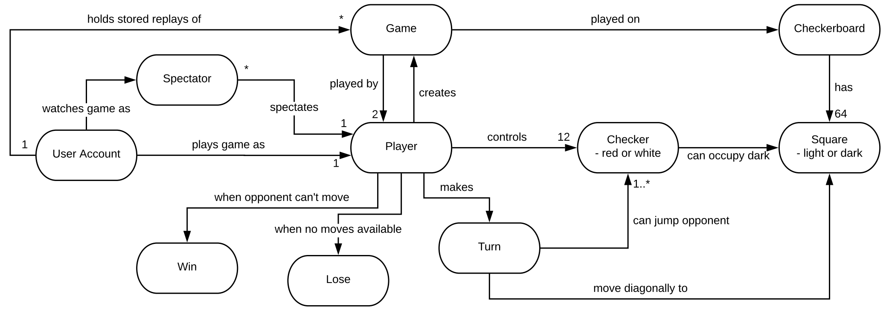
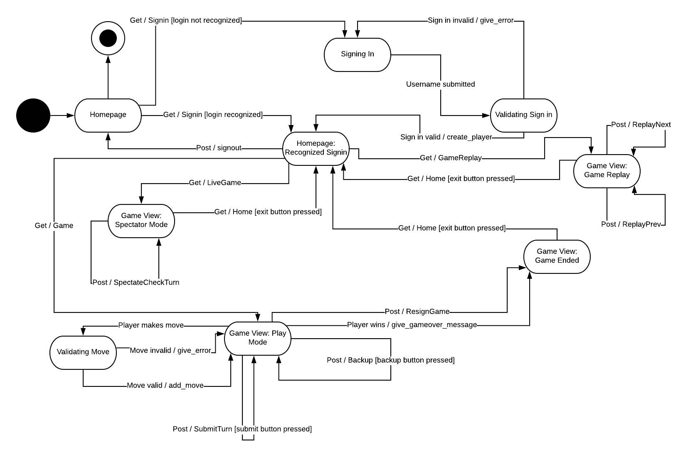
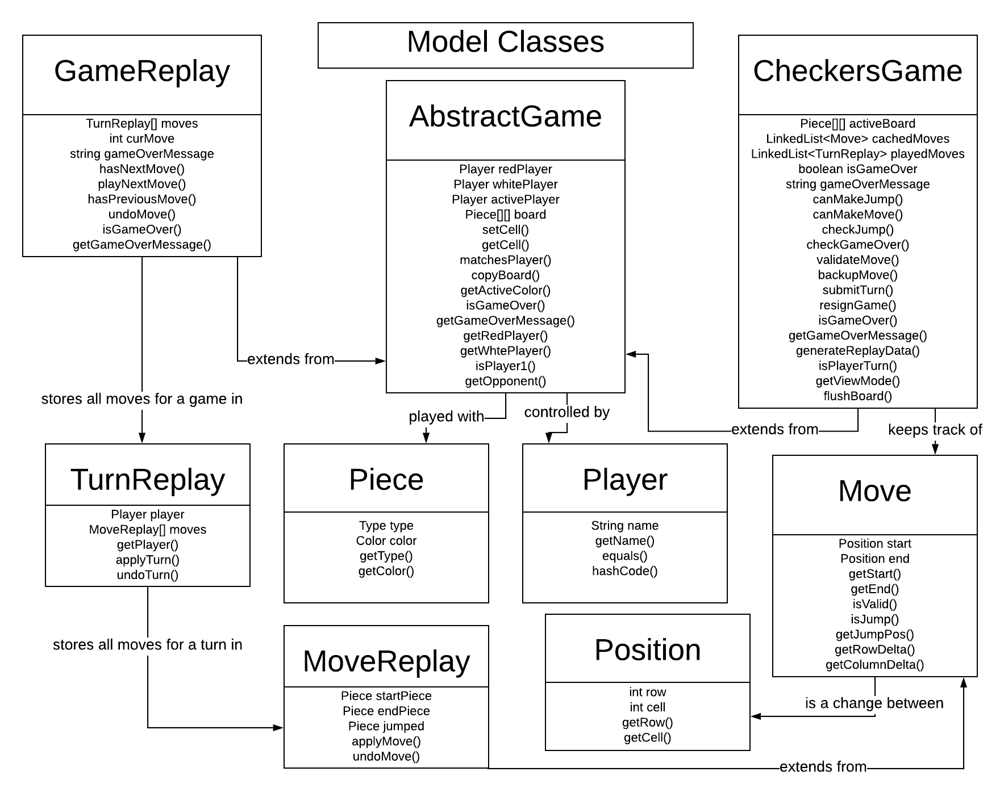

# PROJECT Design Documentation

## Team Information
* Team name: Team B++
* Team members
  * Ryan Kohn
  * Christopher Johns
  * Ryan Floersch
  * Stone Warren
  * Steven McLeod

## Executive Summary

Web Checkers is a simple web game for playing checkers that Team B++ has undertaken under the direction of our SWEN 261 professor. To expand on the MVP, we have chosen to add two enhancements: allowing the user to spectate ongoing games as well as watch replays of previously played games.

### Purpose

Team B++'s purpose with this project is to create an easy to use way for users to play a game of checkers online. Our most important user groups are our professor and our TA, who will be the main users of our game and will expect to have a completely functional, error-free experience. 

### Glossary and Acronyms

| Term | Definition |
|------|------------|
|  |  |

## Requirements

* The user will be able to sign-in to the player lobby and sign-out when done playing.
* The user will be able to start and play checkers games with other players.
* The user will be able to follow the rules of Checkers to move pieces and play the game.
* The user will be able to enter games in alternate modes, including spectator mode and replay mode.

* The user will be able to sign-in to the player lobby and sign-out when done playing.
* The user will be able to start and play checkers games with other players.
* The user will be able to follow the rules of Checkers to move pieces and play the game.
* The user will be able to enter games in alternate modes, including spectator mode and replay mode.

### Definition of MVP
For our minimal viable product, the first thing we need is a functional player lobby that allows players to sign in, out, and start games with unoccupied players. Secondly, we need to complete all in-game functionality such that both players are able to play a game of checkers while following the rules, moving and promoting pieces. Finally, we need to be able to handle games ending through win conditions or player resignation and direct players appropriately.

For our minimal viable product, the first thing we need is a functional player lobby that allows players to sign in, out, and start games with unoccupied players. Secondly, we need to complete all in-game functionality such that both players are able to play a game of checkers while following the rules, moving and promoting pieces. Finally, we need to be able to handle games ending through win conditions or player resignation and direct players appropriately.

### MVP Features
* Player Sign In/Out - Players will be able to sign in and out of the player lobby with a unique username.
* Start Game - Players will be able to start a game with other unoccupied players.
* Play Turn - Players will be able to make legal moves during their turns, and the game will handle alternating turns as players submit their moves.
* Game Ending - Game will recognize and handle win conditions and player resignation.
* Piece Movement - Pieces will be movable according to checkers rules, including handling simple movement, jump moves, multiple jump moves, and king movement.
* Promotion - Pieces will promote themselves to kings when they move to the opposite side of the board from where they started.

* Player Sign In/Out - Players will be able to sign in and out of the player lobby with a unique username.
* Start Game - Players will be able to start a game with other unoccupied players.
* Play Turn - Players will be able to make legal moves during their turns, and the game will handle alternating turns as players submit their moves.
* Game Ending - Game will recognize and handle win conditions and player resignation.
* Piece Movement - Pieces will be movable according to checkers rules, including handling simple movement, jump moves, multiple jump moves, and king movement.
* Promotion - Pieces will promote themselves to kings when they move to the opposite side of the board from where they started.

### Roadmap of Enhancements

* Spectate Game - Players will be able to join and leave ongoing games as a spectator.
* Game Replays - Finished games will be saved and players can watch replays of them.

## Application Domain

This section describes the application domain.

Users sign in to the application and create a user account. From there, they start games with other users and become players in those games. Each game has an 8x8 board made up of light and dark squares and twelve non-king pieces for each player. Players take turns moving the pieces, and moves are made up of single, jump, and multiple jump moves. If a piece moves to the opposite end of the board from its starting position, it is promoted and becomes a king. The game ends when the win conditions are met. Users can also spectate or watch replays of games rather than play in them.

## Architecture and Design

This section describes the application architecture.

### Summary

The following Tiers/Layers model shows a high-level view of the webapp's architecture.

As a web application, the user interacts with the system using a
browser.  The client-side of the UI is composed of HTML pages with
some minimal CSS for styling the page.  There is also some JavaScript
that has been provided to the team by the architect.

The server-side tiers include the UI Tier that is composed of UI Controllers and Views.
Controllers are built using the Spark framework and View are built using the FreeMarker framework.  The Application and Model tiers are built using plain-old Java objects (POJOs).

Details of the components within these tiers are supplied below.

### Overview of User Interface

This section describes the web interface flow; this is how the user views and interacts
with the WebCheckers application.

The user will be directed to the home page first. After the user decides on a username, they will then be directed to a home page that lists both online players and previously played games.

If the user wants to start a game with someone, they can click on the players name and if that player is unoccupied both players will be redirected to a game page. If they are occupied, the user will spectate that game.

Once the game has ended, the players will be shown the ending game screen and can click the exit button to be redirected back to the signed in home page. Spectators can leave at any time by clicking the exit button.

A user may also select a previously played game to watch a replay of it. They can cycle through the different moves of the game by pressing the previous move and next move buttons. They can also at any time return to the home page by pressing the exit button.

### UI Tier

Our UI tier classes consist of different Get and Post Route classes for handling transitions between the game, home, replay, and spectate pages. They give the template engine information on what the webpage should have/look like.

We also have our WebServer class that initializes the different routes, as well as Space and Row classes that make up the gameboard interface.

### Application Tier

The application tier contains our PlayerLobby class, which keeps track of all players and games, handles sign-ins and outs, and puts players in their games/spectations/replays. It also has a ReplayArchive class, which stores all of the game replays.

### Model Tier

The model tier contains classes for all the components of a checkers game and game replay. Both inherit from the abstract class AbstractGame, which contains common attributes such as the players and board.

The GameReplay class stores all the moves for a game and contains methods for cycling through them. These moves are broken down into TurnReplay, all the moves in a turn, and MoveReplay, the move itself.

The CheckersGame class contains a cache of moves in order to allow the user to undo a recently made move. It also stores a list of TurnReplays so that a GameReplay object can later be created using it. Finally, it contains methods for actually playing the game, such as validating and making moves as well as player resignation.  

### Design Improvements

One design improvement we could implement is creating a GameCenter class separate from the PlayerLobby class, which stores all the ongoing games. This will help create a division of responsibilities to better follow the single responsiblity principle. We could also look into having the home page do ajax requests to refresh the page.

If we had time to look into changing the JavaScript, we would replace the beeping sound with something more pleasant.

## Testing

### Acceptance Testing

All acceptance criteria from sprints 1-3 have been passed.

### Unit Testing and Code Coverage

Unit tests have not been fully implemented for every class and scenario, but we do have a good number of them. Unfortuantely, this has caused our code coverage to also be extremely low. We expect this to improve as we continue to create new tests.
